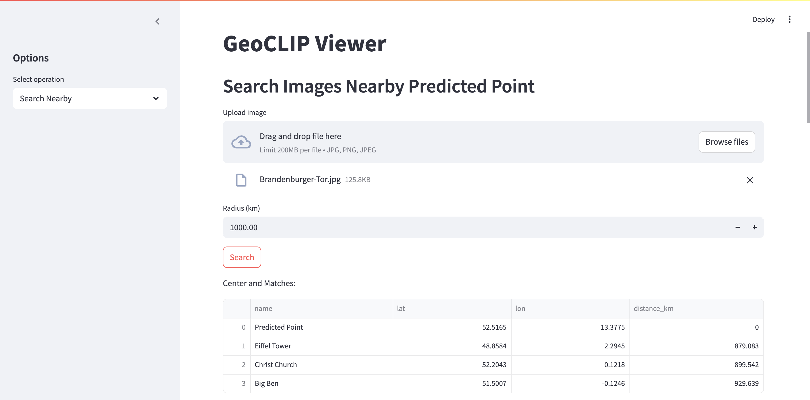
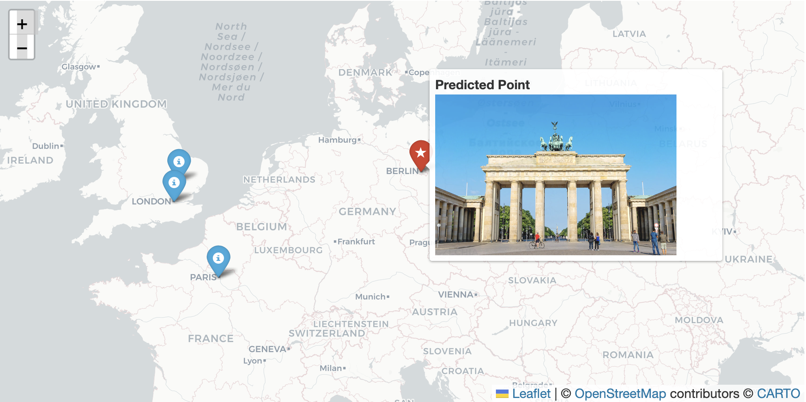
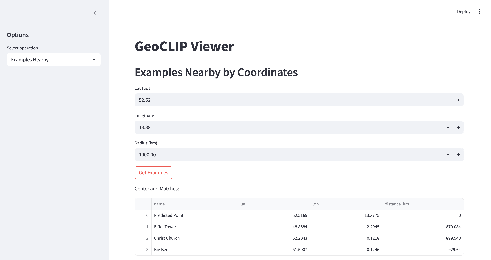

# GeoCLIP FastAPI Service

Комплексный AI-сервис для определения геолокации по фотографии и поиска ближайших достопримечательностей с помощью мультимодели GeoCLIP.  

Проект реализован в рамках научного трека курса **"GenAI / AI-продукты"** и включает:  
- полностью рабочий прототип (MVP),
- веб-интерфейс на Streamlit,
- API на FastAPI,
- отчёт по архитектуре и системному дизайну,
- демонстрацию функциональности (видео),
- контейнеризацию (Docker Compose).

---

## 🎯 Цель проекта

Сервис позволяет:
- 🔍 Определить географические координаты места по загруженному изображению.
- 📍 Найти ближайшие достопримечательности в заданном радиусе из базы (23+ точек).
- 🌐 Изучать местность по координатам и искать объекты рядом.
- 🖥 Работать с результатами в удобном визуальном интерфейсе с картой и изображениями.

### Возможные применения:
- Туристические приложения: "Узнай, где это фото сделано".
- Гео-аннотирование пользовательских снимков для блогов и медиа.
- Образовательные кейсы: демонстрация возможностей мультимодальных моделей.

---

## 🧠 Используемая модель

В основе лежит **GeoCLIP** — мультимодальная модель, дообученная на парах `{изображение, GPS}` на основе архитектуры CLIP.  
Модель возвращает:
- координаты местности,
- вероятностные оценки,
- совместима с задачей поиска ближайших объектов.

---

## 🗂 Структура проекта

```text
.
├── app/                   # Код FastAPI + Streamlit
├── docker/                # SQL init
├── docker-compose.yml
├── Dockerfile
├── requirements.txt
├── screenshots/           # Примеры из UI
├── report/                # Отчёт по архитектуре и дизайну
│   └── report.pdf
├── demo/                  # Скринкаст MVP
│   └── demo.mp4
├── README.md
└── .env.example           # Пример настроек PostgreSQL
````

---

## 🚀 Запуск через Docker Compose

1. Создайте файл `.env`:

   ```dotenv
   POSTGRES_USER=geoclip_user
   POSTGRES_PASSWORD=secret_password
   POSTGRES_DB=geoclip_db
   ```

2. Поднимите сервисы:

   ```bash
   docker-compose up --build -d
   ```

3. Откройте в браузере:

   * 🌐 API: [http://localhost:8000](http://localhost:8000)
   * 📘 Swagger UI: [http://localhost:8000/docs](http://localhost:8000/docs)
   * 🎛 Frontend: [http://localhost:8501](http://localhost:8501)

4. Очистка:

   ```bash
   docker-compose down --rmi all -v
   ```

---

## 📑 API-эндпоинты

### `POST /predict/coords`

Предсказание координат по изображению
**Query:** `top_k` (int)
**Body:** `file` (jpg/png)
**Response:**

```json
{
  "predictions": [
    { "lat": 48.8584, "lon": 2.2945, "prob": 0.85 }
  ]
}
```

### `POST /search/nearby`

Поиск ближайших достопримечательностей
**Query:** `radius_km` (float)
**Body:** `file` (jpg/png)
**Response:**

```json
{
  "center": { "lat": ..., "lon": ... },
  "matches": [
    {
      "id": "...",
      "name": "Eiffel Tower",
      "lat": ..., "lon": ..., "url": "...",
      "distance_km": 0.0
    }
  ]
}
```

### `GET /examples/nearby`

Поиск по координатам
**Query:** `lat`, `lon`, `radius_km`
**Response:** аналогично `/search/nearby`

### `GET /health`

Проверка статуса сервиса
**Response:**

```json
{ "status": "ok" }
```

---

## 🖥 Веб-интерфейс (Streamlit + Folium)

Доступен на [http://localhost:8501](http://localhost:8501)

### Режимы:

#### 1. Predict Coords

* Загружаем фото
* Получаем карту с метками
* Таблица координат и вероятностей
  

#### 2. Search Nearby

* Находим достопримечательности рядом
* Маркеры с изображениями при наведении
  
  

#### 3. Examples Nearby

* Ручной ввод координат
* Получаем похожие объекты
  

---

## 📄 Артефакты проекта

| Вид                   | Файл / ссылка                              |
| --------------------- | ------------------------------------------ |
| 📘 Научный отчёт      | [`report/report.pdf`](./report/report.pdf) |
| 🎥 MVP-демо           | [`demo/demo.mp4`](./demo/demo.mp4)         |

---

## 📦 Зависимости

```txt
torch
geoclip
fastapi
uvicorn[standard]
SQLAlchemy>=1.4
psycopg2-binary
streamlit
folium
streamlit-folium
pandas
requests
Pillow
```

---
