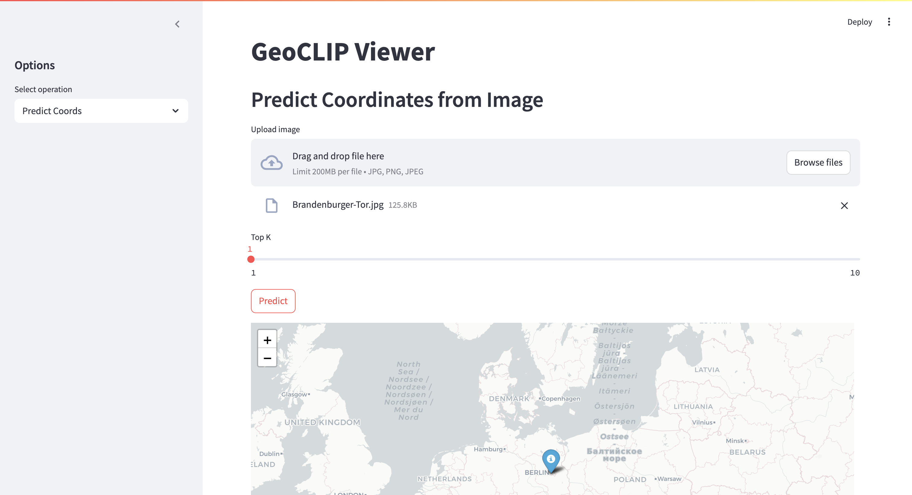

# GeoCLIP FastAPI Service

Комплект сервисов для геолокации по изображению и поиска похожих мест поблизости.

## 🎯 Цель проекта

Сервис позволяет:
- 🔍 Определить географические координаты места по загруженному изображению (модель GeoCLIP).  
- 📍 Искать в базе известных достопримечательностей (23+ точек по всему миру) те, что находятся рядом с предсказанной точкой.  
- 🌐 Давать возможность исследовать любые координаты и находить достопримечательности по радиусу.  
- 🖥 Предоставлять удобный веб-интерфейс для демонстрации результатов на интерактивной карте.

**Кейсы использования**  
- Туристические мобильные приложения: навигация по фото, «узнай, где это».  
- Журнальные сервисы и блоги: быстрая гео-аннотация пользовательских фотографий.  
- Образовательные проекты: демонстрация работы мультимодальных моделей (CLIP + геоданные).  

## 📦 Используемая модель

В качестве ядра сервиса используется **GeoCLIP** — мультимодальная модель на базе CLIP, дообученная для предсказания GPS-координат по изображениям местных достопримечательностей и ландшафтов. GeoCLIP принимает на вход изображение и возвращает список наиболее вероятных геокоординат с оценками уверенности.

## 📁 Структура репозитория

```text
.
├── .env                      # настройки для Postgres контейнера
├── .gitignore
├── README.md                 # описание проекта (вы читаете)
├── Dockerfile                # образ API + frontend
├── docker-compose.yml
├── docker
│   └── db
│       └── init.sql          # инициализация БД и загрузка тестовых данных
├── requirements.txt
├── screenshots               # скриншоты работы фронтенда
│   ├── predict_coords.png
│   ├── search_nearby.png
│   └── examples_nearby.png
└── app
    ├── main.py               # FastAPI-приложение
    ├── model.py              # загрузка GeoCLIP-модели и predict_topk
    ├── db.py                 # SQLAlchemy ORM, init_db()
    ├── database.py           # поисковая логика (Haversine + запросы)
    ├── schemas.py            # Pydantic-модели ответов
    └── frontend.py           # Streamlit + Folium веб-интерфейс
````

## 🚀 Запуск с помощью Docker Compose

1. Создай в корне файл `.env` и задайте параметры:

   ```dotenv
   POSTGRES_USER=geoclip_user
   POSTGRES_PASSWORD=secret_password
   POSTGRES_DB=geoclip_db
   ```

2. Запустите:

   ```bash
   docker-compose up --build -d
   ```

3. Откройте в браузере:

   * **API**: [http://localhost:8000](http://localhost:8000)
   * **Swagger UI**: [http://localhost:8000/docs](http://localhost:8000/docs)
   * **Frontend (Streamlit)**: [http://localhost:8501](http://localhost:8501)

4. При необходимости полностью очистить:

   ```bash
   docker-compose down --rmi all -v
   ```

## 📑 Эндпоинты API

### 1. POST `/predict/coords`

* **Параметры** (query):

  * `top_k` (int, 1–10) — количество координат.
* **Body**: multipart-form `file` (jpg/png).
* **Ответ**:

  ```json
  {
    "predictions": [
      { "lat": 48.8584, "lon": 2.2945, "prob": 0.85 },
      …
    ]
  }
  ```

### 2. POST `/search/nearby`

* **Параметры** (query):

  * `radius_km` (float, 0.1–10000) — радиус поиска.
* **Body**: multipart-form `file` (jpg/png).
* **Ответ**:

  ```json
  {
    "center": { "lat": 48.8584, "lon": 2.2945 },
    "matches": [
      {
        "id": "img001",
        "name": "Eiffel Tower",
        "lat": 48.8584,
        "lon": 2.2945,
        "url": "...raw.githubusercontent.com...",
        "distance_km": 0.0
      }, …
    ]
  }
  ```

### 3. GET `/examples/nearby`

* **Параметры** (query):

  * `lat`  (float, −90–90)
  * `lon`  (float, −180–180)
  * `radius_km` (float, 0.1–10000)
* **Ответ**: аналогичен `/search/nearby`.

### 4. GET `/health`
- **Описание**: проверка работоспособности сервиса, чтобы начать работу.
- **Ответ**:
  ```json
  {
    "status": "ok"
  }

## 🖥 Веб-интерфейс (Streamlit + Folium)

### Основные возможности

* **Predict Coords**
  

* **Search Nearby**
  

* **Examples Nearby**
  

В каждой вкладке:

* Интерактивная карта (Folium) с различными маркерами и большими hover-tooltip (картинка + текст),
* Таблица результатов,
* Превью картинок.

## 📦 Зависимости

```txt
torch
geoclip
fastapi
uvicorn[standard]
SQLAlchemy>=1.4
psycopg2-binary
streamlit
folium
streamlit-folium
pandas
requests
Pillow
```
